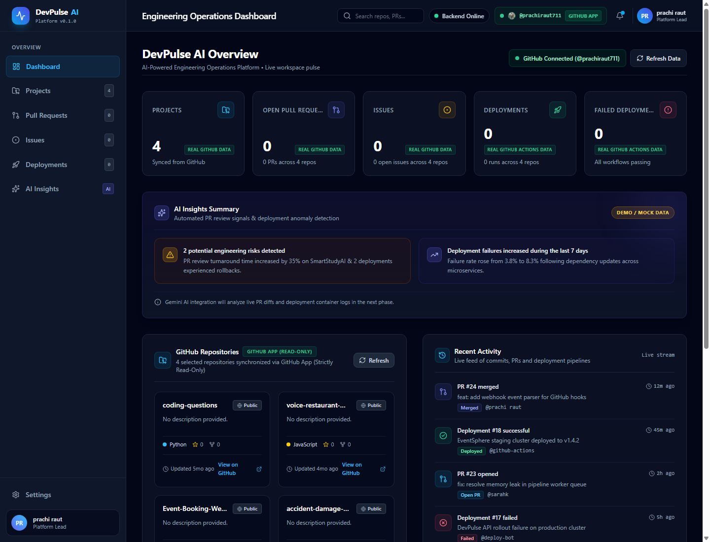
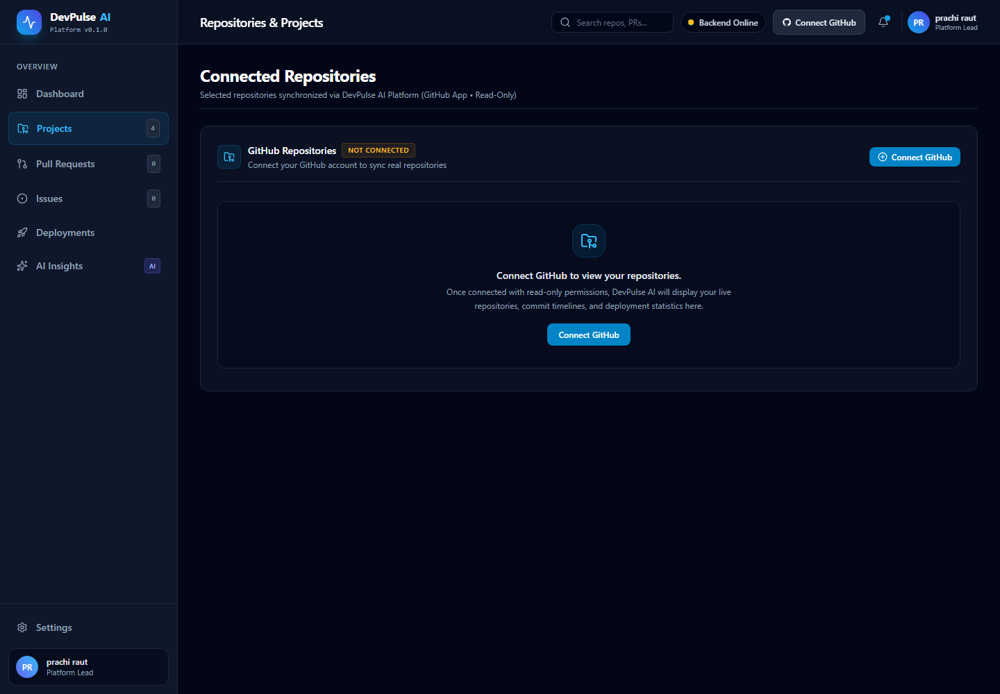
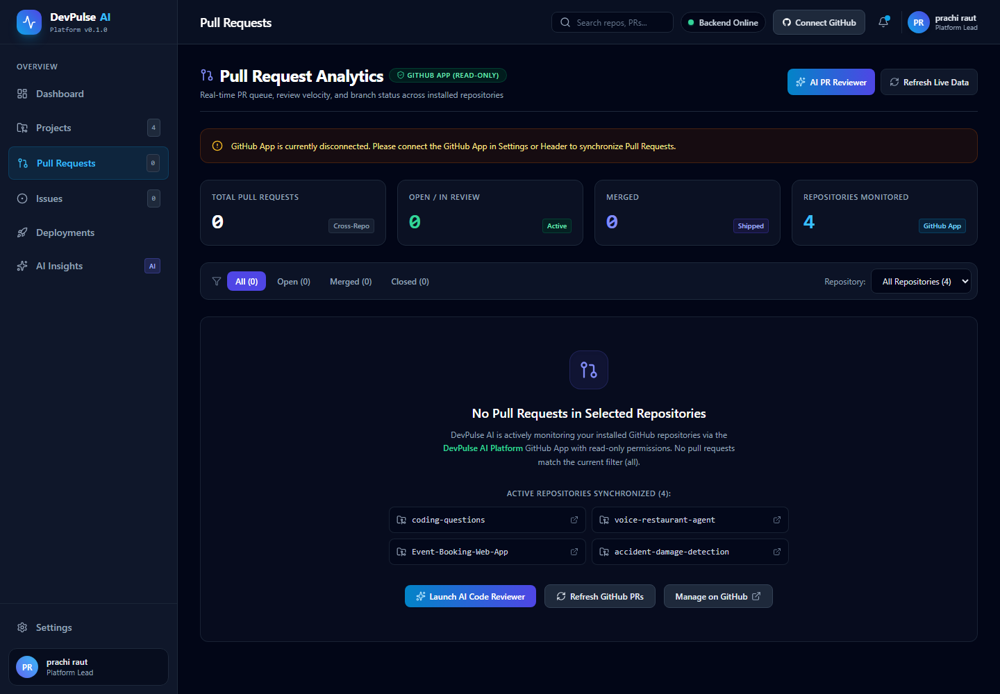
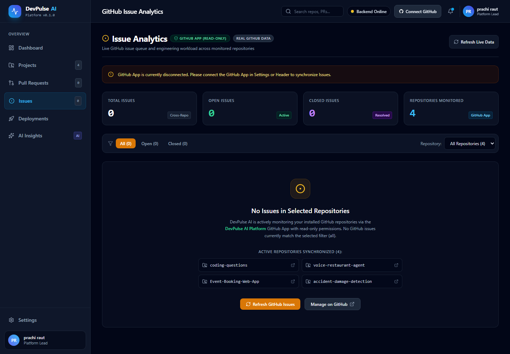
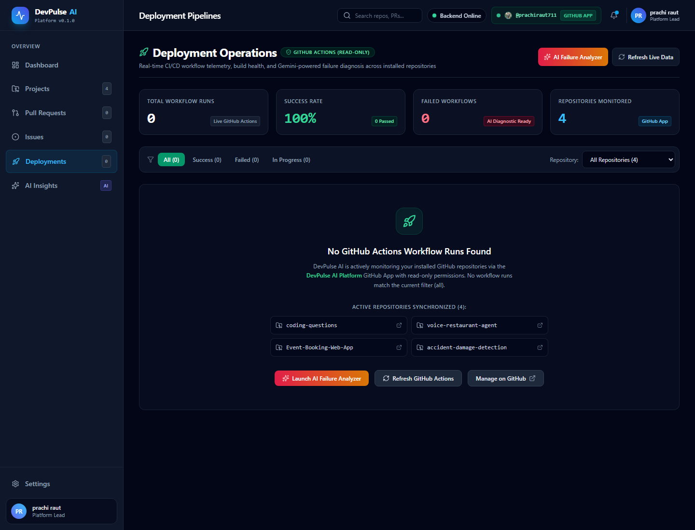
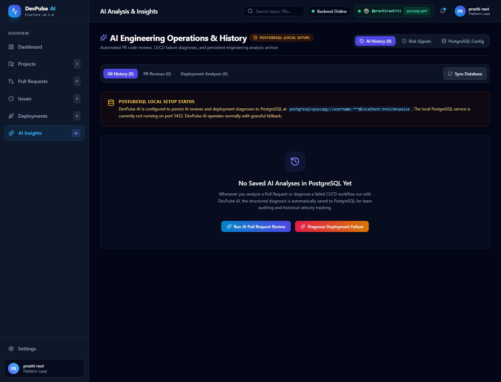
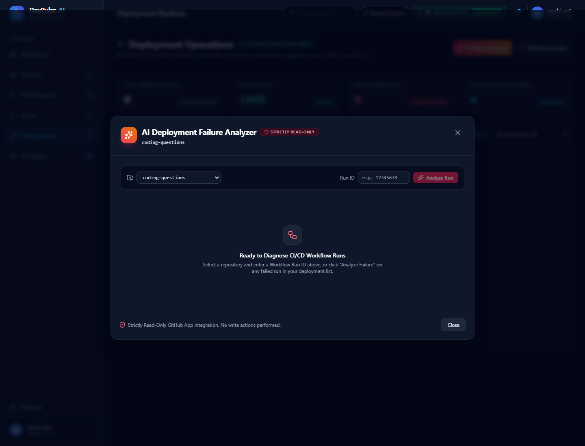
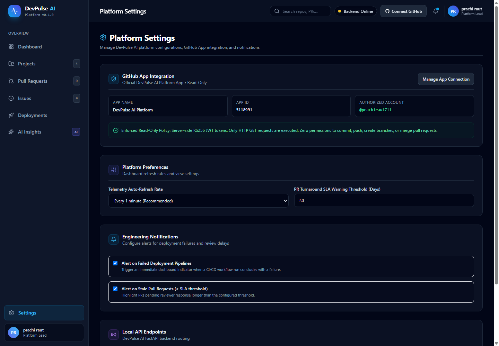

# DevPulse AI

**AI-Powered Engineering Operations Dashboard**

[](https://github.com/prachiraut711/devpulse-ai/actions/workflows/ci.yml)
[](https://fastapi.tiangolo.com)
[](https://react.dev/)
[](https://www.typescriptlang.org/)
[](https://tailwindcss.com/)
[](https://www.postgresql.org/)
[](https://www.docker.com/)

DevPulse AI is an engineering operations dashboard that brings GitHub repository activity, pull request tracking, issue management, CI/CD workflow telemetry, and AI-powered engineering analysis into a single interface. Built with a React and TypeScript frontend and a Python FastAPI backend, it provides developers and engineering leads with a centralized operational view to monitor development velocity, spot pipeline failures, and perform AI-assisted reviews.

---

## 🚀 Live Demo

- **Frontend:** [https://devpulse-ai-frontend.onrender.com](https://devpulse-ai-frontend.onrender.com)
- **Backend:** [https://devpulse-ai-backend.onrender.com](https://devpulse-ai-backend.onrender.com)
- **Backend Health:** [https://devpulse-ai-backend.onrender.com/api/health](https://devpulse-ai-backend.onrender.com/api/health)
- **GitHub Repository:** [https://github.com/prachiraut711/devpulse-ai](https://github.com/prachiraut711/devpulse-ai)

> **Note on Render Free Tier:** The frontend and backend are deployed on Render's free tier. If the application has been inactive, the backend web service may take **30 to 60 seconds** to wake up while the container initializes.

---

## 📌 Overview

During daily software development, engineers frequently juggle multiple tools and browser tabs: checking repository file trees, managing pull request queues, monitoring issue status, and inspecting CI/CD build logs. This fragmentation introduces context-switching overhead and makes it difficult to get a quick, cohesive picture of engineering health across repositories.

**DevPulse AI** addresses this problem by centralizing operational data into a single, intuitive dashboard:
- **Centralized Telemetry:** Retrieves repository status, pull requests, issues, and GitHub Actions workflow runs via a dedicated read-only GitHub App.
- **AI-Assisted Analysis:** Pairs operational data with Google Gemini to provide on-demand advisory code reviews for pull requests and automated root-cause diagnostics for failing CI/CD runs.
- **Operational Clarity:** Helps developers, reviewers, and engineering managers quickly identify bottlenecks, understand deployment failures, and maintain software delivery cadence.

---

## ✨ Key Features

- **Engineering Operations Dashboard:** Centralized summary overview displaying repository counts, pull request activity, workflow runs, engineering health scores, and recent activity timelines.
- **Repository Monitoring:** Overview cards displaying connected GitHub repositories, programming languages, star counts, fork counts, and direct GitHub links.
- **Pull Request Analytics:** Dedicated pull request dashboard with state filtering (All, Open, Merged, Closed), repository filters, and one-click triggers for AI-powered code review.
- **Issue Analytics:** Centralized issue tracking view with status filters (Open, Closed), repository filters, author tags, and issue age indicators.
- **GitHub Actions Telemetry:** Deployment pipeline monitoring showing workflow run statuses (success, failure, queued), target branches, commit SHAs, and failure analysis triggers.
- **AI Pull Request Reviewer:** Evaluates code diffs against software engineering best practices, producing structured findings across risk ratings, potential bugs, security concerns, code quality, and testing advice.
- **AI Deployment Failure Analyzer:** Inspects failed workflow runs and jobs to determine likely root causes, pinpoints failed steps, and suggests actionable code or configuration fixes.
- **AI Analysis History & Persistence:** Relational database storage powered by SQLAlchemy to save and reference past AI review results and deployment analyses.
- **Strictly Read-Only GitHub App Integration:** Secure, least-privilege connection using an official GitHub App that reads repository telemetry without requiring write or mutation permissions.
- **Health & Connectivity Telemetry:** Live indicators for backend service health (`/api/health`), database connectivity status (`/api/database/status`), and GitHub connection state (`/api/github/status`).
- **Responsive Interface:** Adaptive UI built with React 19, TypeScript, and Tailwind CSS, supporting mobile phones (slide-over drawer), tablets, laptops, and desktop monitors.

---

## 📸 Screenshots

All screenshots below are captured directly from the running DevPulse AI application:

### Dashboard



### Projects



### Pull Requests



### Issues



### Deployment Operations



### AI Insights



### AI Deployment Analyzer



### Settings



---

## 💻 Technology Stack

| Category | Technology | Purpose |
| :--- | :--- | :--- |
| **Frontend** | React 19 | Declarative component-based user interface |
| **Language** | TypeScript | Type safety across UI state and API schemas |
| **Build Tool** | Vite | Fast frontend development server and production bundler |
| **Styling** | Tailwind CSS | Responsive, utility-first UI styling |
| **Backend** | FastAPI | High-performance Python REST API with async routing |
| **Language** | Python 3.12 | Backend business logic, API endpoints, and AI prompt engineering |
| **Server** | Uvicorn | High-throughput ASGI server hosting FastAPI |
| **Database** | PostgreSQL 16 | Persistent storage for connection state and AI analysis history |
| **Hosted Database** | Supabase | Production PostgreSQL hosting |
| **AI** | Gemini API | AI pull request code reviews and deployment failure analysis (`gemini-1.5-flash`) |
| **GitHub** | GitHub App | Read-only retrieval of repositories, PRs, issues, and workflow runs |
| **Containers** | Docker | Application containerization for backend (`python:3.12-slim`) and frontend (`nginx:alpine`) |
| **Orchestration** | Docker Compose | Local multi-container development environment |
| **CI** | GitHub Actions | Automated continuous integration validating tests, builds, and Docker configs |
| **Deployment** | Render | Production hosting (Static Site for frontend, Docker Web Service for backend) |

---

## 🏗️ Architecture

```text
                    GitHub
                       │
                       ▼
          GitHub App (Read-Only)
                       │
                       ▼
               FastAPI Backend
                 /     |      \
                /      |       \
               ▼       ▼        ▼
          PostgreSQL  Gemini AI  GitHub APIs
               │
               ▼
        AI Analysis History
                       │
                       ▼
             React + TypeScript
                Dashboard
```

---

## 🔐 GitHub Integration

DevPulse AI integrates with GitHub using an official **GitHub App** configured with **strictly read-only permissions**.

The application reads information such as:
- Repositories, metadata, languages, and commit information
- Pull requests and code diffs
- Issues, labels, and authors
- GitHub Actions workflow runs, statuses, and failed step details

### Security by Design
The application is designed specifically as an observability and diagnostics platform. It **does not require** and **does not include** functionality to:
- Push commits or modify codebase files
- Create, merge, or close pull requests
- Modify, create, or delete branches
- Change repository settings or permissions
- Delete repositories
- Trigger, rerun, or cancel GitHub Actions workflows

### Credential Handling
- **Ephemeral Access:** Server-side authentication uses short-lived installation access tokens generated via RS256 JWTs signed with the App's private key. Tokens expire within 10 minutes and are cached strictly in backend memory.
- **Zero Token Leakage:** GitHub App private keys and installation tokens are kept securely on the server and are never returned in API responses or stored client-side.
- **Masked Diagnostics:** Sensitive configuration details and database URLs are sanitized to mask passwords in logs and status endpoints.

---

## 🤖 AI Features

### AI Pull Request Reviewer
The reviewer retrieves pull request metadata and code diffs via the read-only GitHub App, evaluates the changes against senior engineering practices, and outputs structured findings:
- **Change Summary:** High-level overview of the PR's purpose and scope.
- **Risk Assessment:** Advisory risk classification (`Low`, `Medium`, `High`).
- **Potential Bugs:** Logic flaws, off-by-one conditions, and unhandled edge cases.
- **Security Concerns:** Input validation issues, hardcoded credential risks, and authorization oversights.
- **Code Quality & Maintainability:** Suggestions on readability, naming conventions, and modularity.
- **Performance Considerations:** Inefficient iterations and resource bottlenecks.
- **Testing Recommendations:** Suggested unit and integration test coverage.

*Note:* All AI review findings are purely advisory and read-only. The system never posts comments, submits reviews, or modifies GitHub PR status.

### AI Deployment Failure Analyzer
When a continuous integration workflow fails, the analyzer queries the GitHub Actions API to identify the failing job and step, then prompts Gemini to provide:
- **Likely Root Cause:** AI diagnosis identifying the underlying cause (e.g., dependency mismatch, environment variable absence, failing unit test, syntax error).
- **Failed Step Evidence:** Identification of the exact step name and exit condition.
- **Suggested Checks:** Concrete, step-by-step verification tasks for developers.
- **Possible Fixes:** Actionable code or workflow YAML recommendations.
- **Confidence:** Confidence rating assessed as `High`, `Medium`, or `Low`.

### AI Insights
The dashboard presents summarized operational insights highlighting patterns across connected repositories (such as elevated PR turnaround times or deployment failure frequency trends). Successfully generated PR reviews and failure analyses can be archived to PostgreSQL for historical reference.

---

## 🗄️ Database

DevPulse AI uses **PostgreSQL 16** with **SQLAlchemy 2.x** and the modern **psycopg 3** driver for relational persistence:

- **Data Models:**
  - `platform_connections`: Basic metadata on the connected GitHub App installation (account name, auth method) with zero secrets stored.
  - `ai_review_history`: Archived AI pull request reviews (repository, PR number, title, risk level, structured findings, timestamp).
  - `deployment_analysis_history`: Archived deployment failure analyses (repository, run ID, workflow name, root cause, suggested fixes, timestamp).
- **Production Status:** PostgreSQL is configured for production through Supabase; production persistence requires a valid database connection.
- **Graceful Degradation:** The database module performs lightweight connection checks. If the database is offline or authentication credentials require renewal, the backend logs a warning, reports the state safely via `GET /api/database/status`, and continues running without crashing, serving demo data in the UI.

---

## 🐳 Docker

DevPulse AI includes a multi-container Docker configuration orchestrated via Docker Compose:

- **PostgreSQL:** Containerized relational database with persistent named volume (`devpulse_postgres_data`).
- **FastAPI Backend:** Container running Python 3.12-slim with curl health checking.
- **React Frontend:** Multi-stage production container (Node 20 build stage → Nginx Alpine runtime) serving the static SPA and reverse-proxying `/api` requests to the backend.

To run the complete multi-container setup locally:

```bash
docker compose up --build -d
```

---

## ✅ Continuous Integration

Automated continuous integration is configured using **GitHub Actions** in [`.github/workflows/ci.yml`](.github/workflows/ci.yml).

The workflow runs on every `push` and `pull_request` targeting `main` and `master`, running three concurrent validation jobs:

1. **Backend Validation:**
   - Installs Python 3.12 with `pip` dependency caching.
   - Spins up an ephemeral `postgres:16-alpine` container service for real database compatibility testing.
   - Installs backend dependencies from `backend/requirements.txt`.
   - Validates application imports and startup routines.
   - Executes the automated smoke test suite (`backend/tests/test_smoke.py`).
2. **Frontend Validation:**
   - Installs Node.js 20 with `npm` dependency caching.
   - Runs a clean installation (`npm ci`).
   - Executes strict TypeScript typechecking (`tsc -b`) and compiles the production Vite bundle (`vite build`).
3. **Docker Validation:**
   - Validates `docker-compose.yml` service definitions and volume configurations (`docker compose config --quiet`).
   - Builds the backend Docker image (`docker build ./backend`).
   - Builds the frontend multi-stage Docker image (`docker build ./frontend`).

*Note on Deployments:* GitHub Actions is dedicated to automated code quality and build validation. Production deployment to Render is managed independently through Render's Git deployment integration.

---

## 🛠️ Run Locally

Follow these steps to run the application locally on your machine:

### Prerequisites
- **Git**
- **Python 3.12+**
- **Node.js 20+** and **npm**
- **Docker** and **Docker Compose** (optional, for containerized execution)

---

### Option 1: Using Docker Compose (Quickest)

1. **Clone the repository:**
   ```bash
   git clone https://github.com/prachiraut711/devpulse-ai.git
   cd devpulse-ai
   ```

2. **Configure environment variables:**
   ```bash
   cp backend/.env.example backend/.env
   ```
   *(Optionally add your `GEMINI_API_KEY` in `backend/.env` to test live AI reviews).*

3. **Start all services:**
   ```bash
   docker compose up --build -d
   ```

4. **Open in browser:**
   - Frontend: [http://localhost:5173](http://localhost:5173)
   - Backend API & Interactive Docs: [http://localhost:8000/docs](http://localhost:8000/docs)

---

### Option 2: Running Services Manually

#### 1. Backend Setup (FastAPI)
```bash
cd backend

# Create and activate a virtual environment
python -m venv venv
# On Windows PowerShell:
.\venv\Scripts\Activate.ps1
# On macOS / Linux:
source venv/bin/activate

# Install dependencies
pip install -r requirements.txt

# Create environment file from template
cp .env.example .env

# Run FastAPI with live reload
uvicorn app.main:app --reload --port 8000
```
Backend health check: [http://localhost:8000/api/health](http://localhost:8000/api/health)

#### 2. Frontend Setup (React + Vite)
```bash
cd frontend

# Install dependencies
npm install

# Start Vite development server
npm run dev
```
Frontend development server: [http://localhost:5173](http://localhost:5173)

---

## ℹ️ Live Data & Demo Note

- **Connected GitHub Data:** When connected to the GitHub App, the dashboard retrieves live information from installed repositories.
- **Empty States:** For newly created or inactive repositories, analytics tabs (such as Pull Requests or Issues) accurately reflect 0 active items.
- **Demo Fallback Data:** When external live integrations (such as the GitHub App or PostgreSQL database) are not connected or unreachable, DevPulse AI displays structured fallback demo data to enable UI exploration and testing.
- **Data Integrity:** The application maintains a clear distinction between demo data and live GitHub telemetry, ensuring demo metrics are never misreported as real activity.

---

## 📂 Project Structure

```text
devpulse-ai/
├── .github/
│   └── workflows/
│       └── ci.yml                   # GitHub Actions CI workflow
├── backend/
│   ├── app/
│   │   ├── routes/                  # API endpoints (AI, GitHub, GitHub Auth)
│   │   ├── services/                # Business logic (Gemini AI, GitHub client)
│   │   ├── config.py                # Environment configuration loader
│   │   ├── database.py              # SQLAlchemy engine & session management
│   │   ├── main.py                  # FastAPI application entry & CORS
│   │   ├── models.py                # SQLAlchemy ORM models
│   │   └── schemas.py               # Typed Pydantic request/response models
│   ├── tests/
│   │   └── test_smoke.py            # Automated smoke tests for core API & DB
│   ├── .dockerignore
│   ├── .env.example                 # Backend environment variable template
│   ├── Dockerfile                   # Python 3.12-slim FastAPI container
│   └── requirements.txt             # Python dependencies
├── docs/
│   └── screenshots/                 # Application preview screenshots
│       ├── ai-deployment-analyzer.png
│       ├── ai-insights.png
│       ├── dashboard.png
│       ├── deployments.png
│       ├── issues.png
│       ├── projects.png
│       ├── pull-requests.png
│       └── settings.png
├── frontend/
│   ├── public/                      # Static assets & favicon
│   ├── src/
│   │   ├── components/              # Modular React UI views & modals
│   │   ├── mock/                    # Fallback demo data structures
│   │   ├── types/                   # TypeScript interfaces
│   │   ├── App.tsx                  # Main application orchestrator & tab routing
│   │   ├── index.css                # Tailwind CSS global styles
│   │   └── main.tsx                 # React application mount point
│   ├── .dockerignore
│   ├── Dockerfile                   # Multi-stage Node 20 / Nginx container
│   ├── nginx.conf                   # Nginx reverse proxy configuration
│   ├── package.json                 # Frontend dependencies and scripts
│   └── vite.config.ts               # Vite configuration & dev proxy
├── .dockerignore                    # Root Docker build context ignore rules
├── .env.example                     # Root environment variable template
├── .gitignore                       # Git ignore definitions
├── docker-compose.yml               # Multi-container orchestration definition
└── README.md                        # Project documentation
```

---

## 🔭 Future Improvements

Planned future enhancements for DevPulse AI:
- **DORA Metrics Integration:** Tracking key velocity metrics including deployment frequency, lead time for changes, change failure rate, and mean time to restore.
- **Multi-Provider CI/CD Support:** Expanding workflow monitoring to support GitLab CI, CircleCI, and Bitbucket Pipelines.
- **Alerting & Webhook Notifications:** Automated notifications via Slack, Microsoft Teams, or Discord when production deployments fail.
- **Historical Trend Visualization:** Long-term timeline charts illustrating team review velocity, PR turnaround duration, and issue resolution trends across sprints.
- **Team-Level Analytics:** Filtering and comparing operational metrics across specific engineering squads or feature teams.
- **Enhanced Observability:** Richer production database telemetry and query performance monitoring.

---

## 💼 Portfolio Summary

**DevPulse AI** is an AI-powered engineering operations dashboard that unifies GitHub repository activity, pull request tracking, issue management, and CI/CD workflow telemetry into a single application. Built with a React, TypeScript, and Tailwind CSS frontend and a Python FastAPI backend, it integrates a read-only GitHub App for telemetry retrieval, Google Gemini for advisory code reviews and deployment failure explanations, and PostgreSQL for persistent analysis history. The application is containerized with Docker and Docker Compose, continuously validated via GitHub Actions CI, and deployed on Render.

---

## 🎤 Interview Summary

> *"DevPulse AI is an AI-powered engineering operations dashboard. I built the frontend with React, TypeScript and Tailwind and the backend with Python and FastAPI. I integrated a read-only GitHub App to retrieve engineering activity and integrated Gemini for PR review and deployment failure analysis. PostgreSQL is used for persistent AI analysis history. I containerized the application using Docker and Docker Compose, configured GitHub Actions for CI, and deployed the frontend and backend on Render."*

---

## 👩‍💻 Author

**Prachi Raut**

- GitHub: [https://github.com/prachiraut711](https://github.com/prachiraut711)
